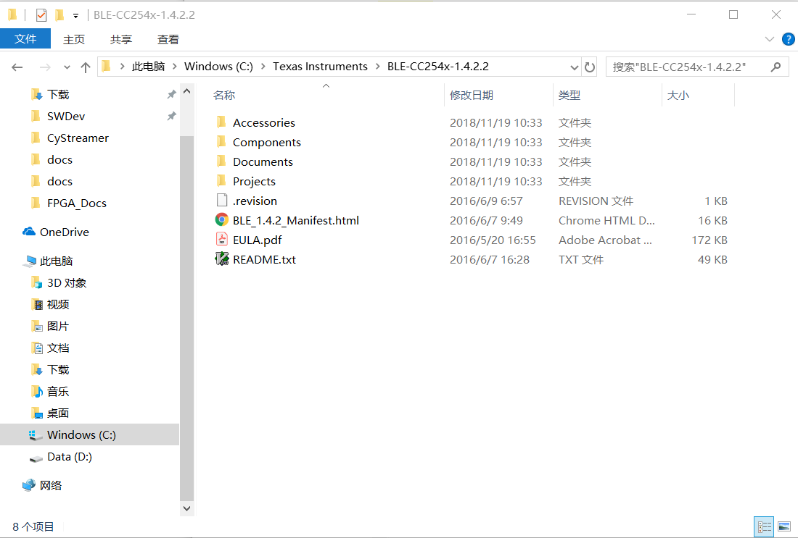
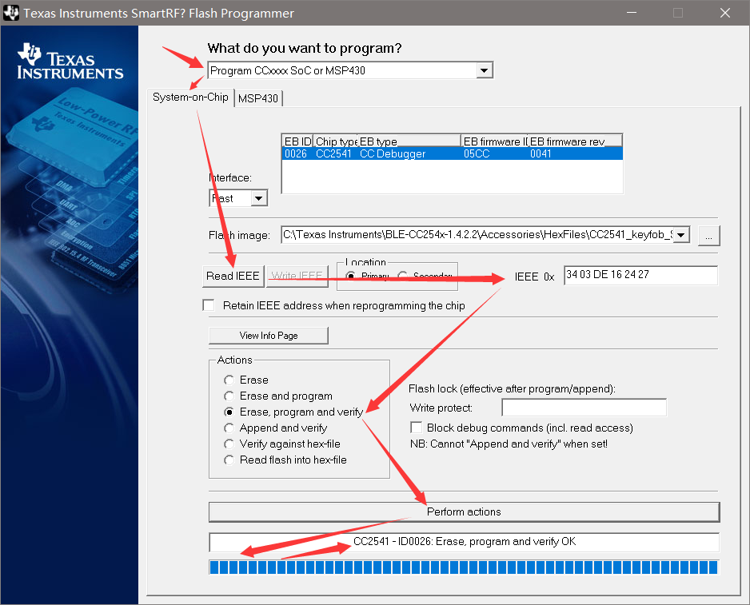

# Development Kit Dowanload

## 参考文档

* [CC2541 (ACTIVE) Bluetooth low energy and proprietary wireless MCU](http://www.ti.com/product/CC2541/toolssoftware)
* [CC2541 Mini Development Kit](http://www.ti.com/tool/cc2541dk-mini)

## Download BLE Stack And Install

* Download Stack：[Bluetooth low energy software stack](http://www.ti.com/tool/ble-stack);
* Install：
  

## IAR Download

目前的Sample Code只使用IAR开发工具，所以只能用IAR开发工具，免费版本有4k代码限制，和Keil一样，30天试用版本是没有限制的:  
https://www.iar.com/iar-embedded-workbench/#!?architecture=8051

## SmartRF 

* [SmartRF Studio](http://www.ti.com/tool/download/SMARTRFTM-STUDIO/)
* [SmartRF Flash Programmer](http://www.ti.com/tool/flash-programmer): use v1;  
  
* [SmartRF Protocol Packet Sniffer](http://www.ti.com/tool/packet-sniffer): use v1;
