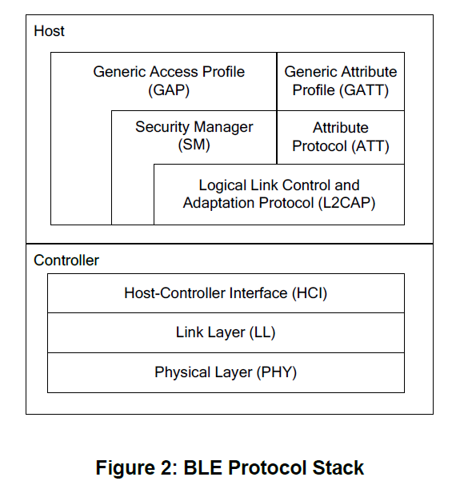

# BLE Base

## 参考文档

[蓝牙4.0 BLE开发完全手册 物联网开发技术实战电子书，基于CC2540](https://e2echina.ti.com/question_answer/wireless_connectivity/bluetooth/f/103/t/156405)

## 蓝牙4.0架构



* `Physical Layer`: `1Mbps`自适应跳频的`GFSK`射频；
* `Link Layer`: 用于控制设备的射频状态，个人觉得可以认为是网卡（MAC）的PHY；
* `Host Controller Interface`: 主机和控制器之间的标准通信接口，例如UART、SPI、USB；
* `Security Manager`: 配对和密钥分配方式，并且为协议栈其他层与另一个设备之间的安全连接和数据交互提供服务；
* `Attribute protocol`: 允许设备向另一个设备展示一块特定的数据，称之为属性；
* `Generic Attribute profile`: 定义了使用ATT的服务架构；

## OSAL操作系统

* 蓝牙4.0 BLE协议栈包含了蓝牙4.0 BLE协议所规定的基本功能，这些功能是以函数的形式实现的；
* 为了便于管理这些函数集，蓝牙4.0 BLE协议栈加入了一个小的操作系统，称为OSAL(操作系统抽象层)；
* BLE协议栈、profiles以及所有应用程序都是建立在OSAL基础上的；
* OSAL（Operating System Abstraction Layer），即操作系统抽象层：
  * 资源（Resource）：变量、数组、结构体；
  * 共享资源（Shared Resource）：被两个及以上任务使用的资源；
  * 任务（Task）：一个任务，又称作一个线程；
  * 多任务运行（Muti-task Running）：一个时间点只有一个任务在运行，采用任务调度策略将多任务进行调度；
  * 内核（Kernel）：在多任务系统种，内核负责管理各个任务；
  * 互斥（Mutual Exclusion）：解决共享数据的访问问题；
  * 消息队列（Message Queue）：任务间消息传递；
* OSAL运行机理：
  * 在基于蓝牙4.0 BLE协议栈的应用程序开发过程中，更多的只是需要实现应用层的程序开发即可；
  * 可以把一个应用程序对象看作为一个任务；
  * 时间和任务的时间处理函数是怎么联系到一起？蓝牙4.0 BLE采用建立一个事件表，保存各个任务对应的事件，建立一个函数表，保存各个任务事件处理函数的地址，然后将这两张表建立某种对应的关系，当某一种事件发生时则查找函数表找到对应的事件处理函数即可；
  * 蓝牙4.0 BLE协议栈，三个变量非常重要：
    * `tasksCnt`：保存了任务的总个数；
    * `tasksEvents`：指向事件表的首地址；
    * `tasksArr`：指向事件处理函数；
    * `taskEvents`和`tasksArr`的index是一一对应的：
      ```C
      do {
        if (tasksEvents[idx])  // Task is highest priority that is ready.
        {
          break;
        }
      } while (++idx < tasksCnt);

      if (idx < tasksCnt)
      {
        uint16 events;
        halIntState_t intState;

        HAL_ENTER_CRITICAL_SECTION(intState);
        events = tasksEvents[idx];                  <------------------+
        tasksEvents[idx] = 0;  // Clear the Events for this task.      |
        HAL_EXIT_CRITICAL_SECTION(intState);                           |
                                                                       |
        activeTaskID = idx;                                            |    
        events = (tasksArr[idx])( idx, events );    <------------------+    
        activeTaskID = TASK_NO_TASK;

        HAL_ENTER_CRITICAL_SECTION(intState);
        tasksEvents[idx] |= events;  // Add back unprocessed events to the current task.
        HAL_EXIT_CRITICAL_SECTION(intState);
      }
      ```
  * 通过`taskEvents`指针访问事件表的每一项，如果有事件发生，则查找函数表找到事件处理函数进行处理，处理完成后，继续访问事件表，查看是否有事件发生，无限循环；
  * OSAL是一种基于事件驱动的轮询式操作系统。事件驱动是指发生事件后采取相应的事件处理方法，轮询指的是不断的查询是否有事件发生；
  * 蓝牙4.0 BLE协议栈使用unsigned short型变量，占2个字节，16bit，每个bit表示一个事件；
    ```C
    uint16 SimpleBLEPeripheral_ProcessEvent( uint8 task_id, uint16 events )
    {
    
        VOID task_id; // OSAL required parameter that isn't used in this function
    
        if ( events & SYS_EVENT_MSG )   // message from system
        {
            uint8 *pMsg;
    
            // 获取消息体
            if ( (pMsg = osal_msg_receive( simpleBLEPeripheral_TaskID )) != NULL )
            {
                // 处理消息
                simpleBLEPeripheral_ProcessOSALMsg( (osal_event_hdr_t *)pMsg );
    
                // Release the OSAL message
                // 释放消息
                VOID osal_msg_deallocate( pMsg );
            }
    
            // return unprocessed events
            // 返回未处理的消息
            return (events ^ SYS_EVENT_MSG);
        }
    
        // 设备开始启动事件
        if ( events & SBP_START_DEVICE_EVT )
        {
            // Start the Device
            VOID GAPRole_StartDevice( &simpleBLEPeripheral_PeripheralCBs );
    
            // Start Bond Manager
            VOID GAPBondMgr_Register( &simpleBLEPeripheral_BondMgrCBs );
    
            // Set timer for first periodic event
            osal_start_timerEx( simpleBLEPeripheral_TaskID, SBP_PERIODIC_EVT, SBP_PERIODIC_EVT_PERIOD );
    
            return ( events ^ SBP_START_DEVICE_EVT );
        }
    
        // 周期性事件处理
        if ( events & SBP_PERIODIC_EVT )
        {
            // Restart timer
            if ( SBP_PERIODIC_EVT_PERIOD )
            {
                osal_start_timerEx( simpleBLEPeripheral_TaskID, SBP_PERIODIC_EVT, SBP_PERIODIC_EVT_PERIOD );
            }
    
            // Perform periodic application task
            performPeriodicTask();
    
            return (events ^ SBP_PERIODIC_EVT);
        }
    
        // Discard unknown events
        return 0;
    }
    ```
  * 协议栈已经给出了几个已经定义好的事件，由协议栈定义的事件称为系统强制事件，`SYS_EVENT_MSG`就是其中一个事件，`SYS_EVENT_MSG`的定义如下：`#define SYS_EVENT_MSG    0x8000`；
  * OSAL维护了一个消息队列，每一个消息都会被放到这个消息队列中去，当任务接收到事件后，可以从消息队列种获取属于自己的消息，然后调用消息处理函数进行相应的处理即可；
  * OSAL添加任务：
    ```C
    // The order in this table must be identical to the task initialization calls below in osalInitTask.
    const pTaskEventHandlerFn tasksArr[] =
    {
        LL_ProcessEvent,                                                  // task 0
        Hal_ProcessEvent,                                                 // task 1
        HCI_ProcessEvent,                                                 // task 2
    #if defined ( OSAL_CBTIMER_NUM_TASKS )
        OSAL_CBTIMER_PROCESS_EVENT( osal_CbTimerProcessEvent ),           // task 3
    #endif
        L2CAP_ProcessEvent,                                               // task 4
        GAP_ProcessEvent,                                                 // task 5
        SM_ProcessEvent,                                                  // task 6
        GATT_ProcessEvent,                                                // task 7
        GAPRole_ProcessEvent,                                             // task 8
        GAPBondMgr_ProcessEvent,                                          // task 9
        GATTServApp_ProcessEvent,                                         // task 10
        SimpleBLEPeripheral_ProcessEvent                                  // task 11
    };
    
    const uint8 tasksCnt = sizeof( tasksArr ) / sizeof( tasksArr[0] );
    uint16 *tasksEvents;
    
    /*********************************************************************
     * FUNCTIONS
     *********************************************************************/
    
    /*********************************************************************
     * @fn      osalInitTasks
     *
     * @brief   This function invokes the initialization function for each task.
     *
     * @param   void
     *
     * @return  none
     */
    void osalInitTasks( void )
    {
        uint8 taskID = 0;
    
        tasksEvents = (uint16 *)osal_mem_alloc( sizeof( uint16 ) * tasksCnt);
        osal_memset( tasksEvents, 0, (sizeof( uint16 ) * tasksCnt));
    
        /* LL Task */
        LL_Init( taskID++ );
    
        /* Hal Task */
        Hal_Init( taskID++ );
    
        /* HCI Task */
        HCI_Init( taskID++ );
    
    #if defined ( OSAL_CBTIMER_NUM_TASKS )
        /* Callback Timer Tasks */
        osal_CbTimerInit( taskID );
        taskID += OSAL_CBTIMER_NUM_TASKS;
    #endif
    
        /* L2CAP Task */
        L2CAP_Init( taskID++ );
    
        /* GAP Task */
        GAP_Init( taskID++ );
    
        /* SM Task */
        SM_Init( taskID++ );
        
        /* GATT Task */
        GATT_Init( taskID++ );
    
        /* Profiles */
        GAPRole_Init( taskID++ );
        GAPBondMgr_Init( taskID++ );
    
        GATTServApp_Init( taskID++ );
    
        /* Application */
        SimpleBLEPeripheral_Init( taskID );
    }
    ```
  * OSAL应用编程接口：`C:\Texas Instruments\BLE-CC254x-1.4.2.2\Documents\osal\OSAL API.pdf`
* 硬件抽象层：提供硬件服务而又不涉及太多硬件细节的层，为应用提供访问的GPIO、UART、ADC等硬件接口；
  * `HAL Common`：文件夹包含协议栈、MAC和驱动中使用到相关配置文件，其中`hal_drivers.c`文件包含所有驱动初始化及相关事件处理机制，主要包含以下三个函数：
    * `Hal_Init()`：由`osalTaskAdd`调度，以便在OSAL中注册HAL的驱动；
    * `HalDriverInit()`：由main()函数调用来初始化硬件驱动；
    * `Hal_ProcessEvent()`：这个函数用来处理OSAL中的HAL相关的驱动事件；
