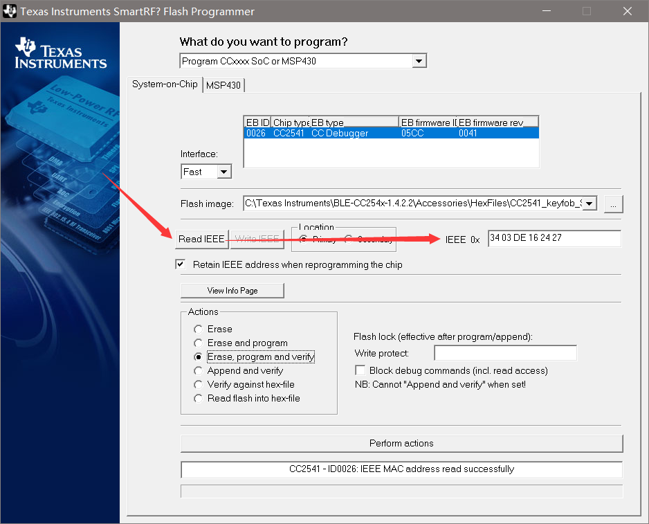
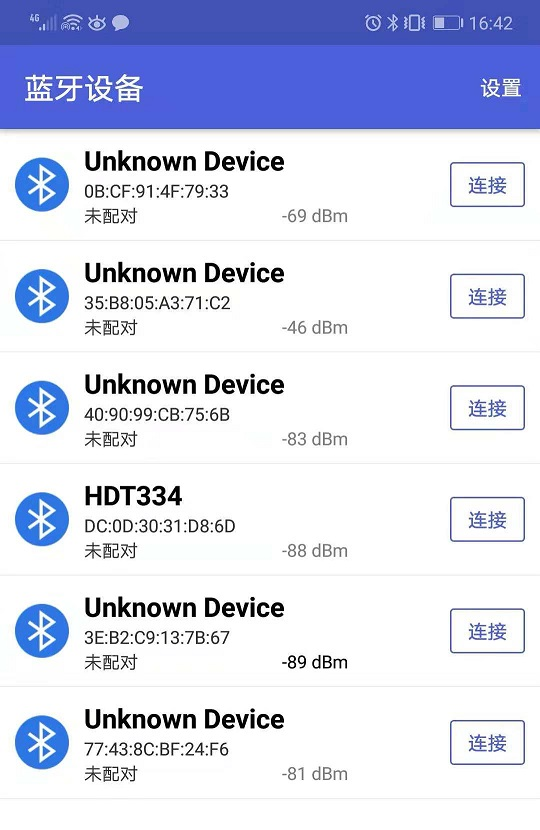
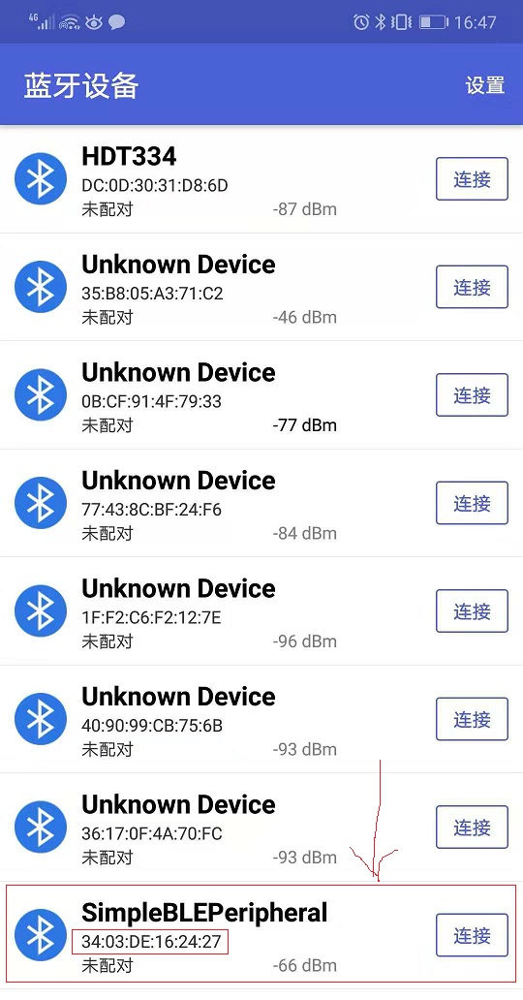
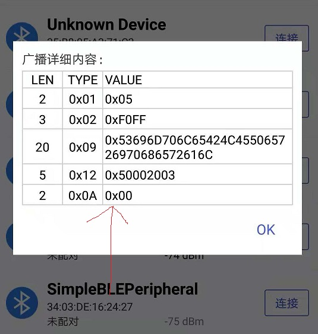
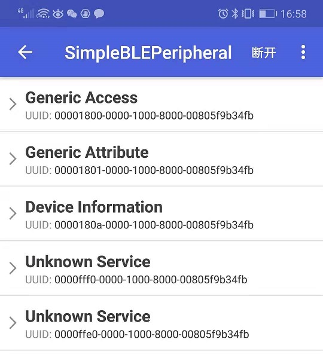
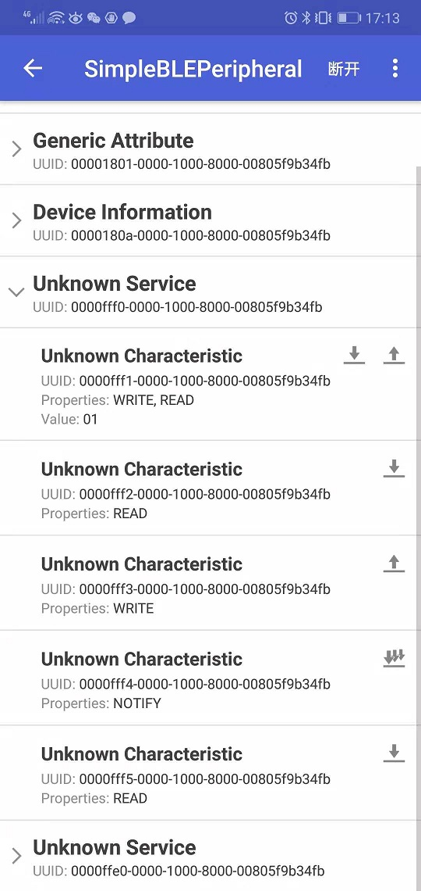
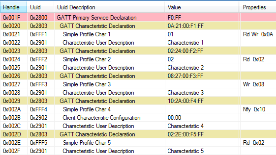
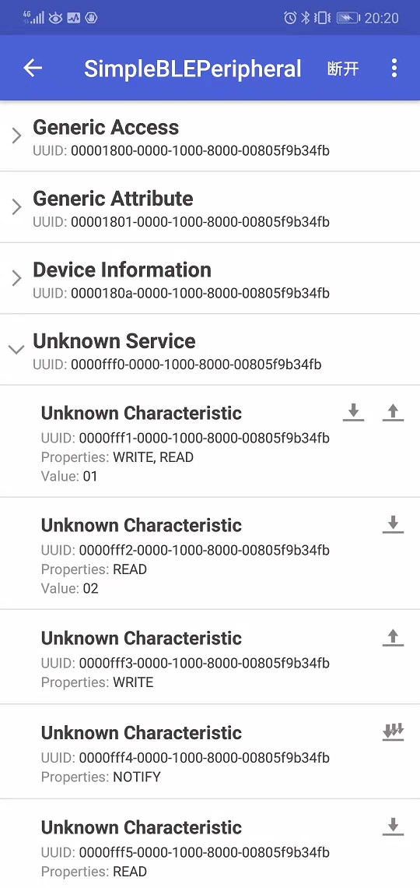

# Android BLE Debuger

## 获取蓝牙地址

## Android BLE Debuger Install

* **BLE Scanner**比blecore更好用
* https://github.com/fszeng2011/blecore
* 华为手机可以直接在AppGallery检索安装：`BLE Debugger`  
  

## 使用方法

* 烧录：`C:\Texas Instruments\BLE-CC254x-1.4.2.2\Accessories\HexFiles\CC2541_SmartRF_SimpleBLEPeripheral.hex`
* 按下`S1`按键，启动程序，一定要按下这个按键，然后Android软件能够检测到设备；  
  
* 获取到的蓝牙广播：  
  
* 连接设备，查看Profile：  
  
* 获取、修改属性：  
  

## Simple GATT Profile Characteristic Table

* BTool Show:  
  
* BLECORE Show:  
  
