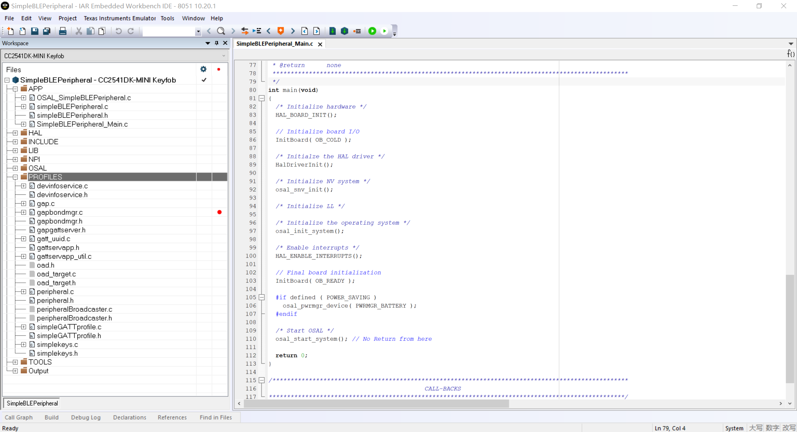
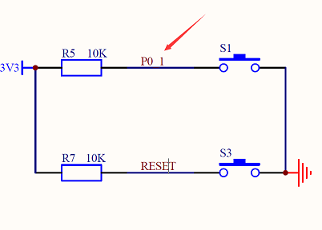
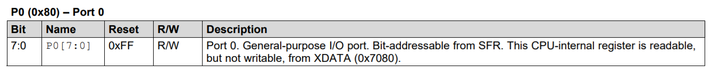
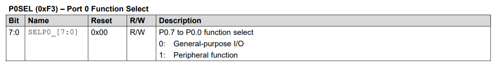
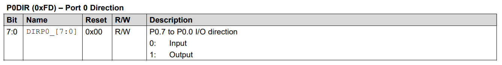
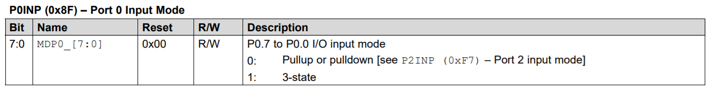
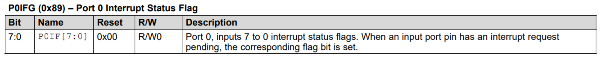
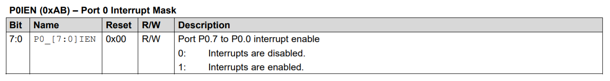

# SimpleBLEPeripheral Hack

## 参考文档

[CC253x/4x User's Guide (Rev. F)](http://www.ti.com/lit/pdf/swru191)

## Source Code

`C:\Texas Instruments\BLE-CC254x-1.4.2.2\Projects\ble\SimpleBLEPeripheral`  


## HAL Key To Start

### Hardware

* Schematic  
  
* Register  
    
    
    
    
    
    

### Code Hack

* `int main(void)`
  * `HalDriverInit()`
    * `HalKeyInit()`
      ```C
      void HalKeyInit( void )
      {
          halKeySavedKeys = 0;  // Initialize previous key to 0.
      
      #if defined ( CC2540_MINIDK )
          HAL_KEY_SW_1_SEL &= ~(HAL_KEY_SW_1_BIT);    /* Set pin function to GPIO */
          HAL_KEY_SW_1_DIR &= ~(HAL_KEY_SW_1_BIT);    /* Set pin direction to Input */
          // 设置GPIO
          HAL_KEY_SW_2_SEL &= ~(HAL_KEY_SW_2_BIT);    /* Set pin function to GPIO */
          // 设置为输入
          HAL_KEY_SW_2_DIR &= ~(HAL_KEY_SW_2_BIT);    /* Set pin direction to Input */
      #else
          [...省略]
      
      #if defined ( CC2540_MINIDK )
          /* Rising/Falling edge configuratinn */
          PICTL |= HAL_KEY_SW_1_EDGEBIT;   /* Set the edge bit to set falling edge to give int */
          // 打开中断
          HAL_KEY_SW_1_IEN |= ( HAL_KEY_SW_1_IENBIT | HAL_KEY_SW_2_IENBIT );   /* enable CPU interrupt */  
      #endif
      }
      // 注册中断处理函数
      HAL_ISR_FUNCTION( halKeyPort0Isr, P0INT_VECTOR )
      {
          HAL_ENTER_ISR();
      
      #if defined ( CC2540_MINIDK )
          if ((HAL_KEY_SW_1_PXIFG & HAL_KEY_SW_1_BIT) || (HAL_KEY_SW_2_PXIFG & HAL_KEY_SW_2_BIT))
      #else
          if (HAL_KEY_SW_6_PXIFG & HAL_KEY_SW_6_BIT)
      #endif
          {
              // 处理中断
              halProcessKeyInterrupt();
          }
      
          [...省略]
      }
      ```
      * `halProcessKeyInterrupt()`
        ```C
        void halProcessKeyInterrupt (void)
        {
            bool valid=FALSE;
        
        #if defined ( CC2540_MINIDK )
            if( HAL_KEY_SW_1_PXIFG & HAL_KEY_SW_1_BIT) /* Interrupt Flag has been set by SW1 */
            {
                HAL_KEY_SW_1_PXIFG = ~(HAL_KEY_SW_1_BIT); /* Clear Interrupt Flag */
                valid = TRUE;
            }
        
            if (HAL_KEY_SW_2_PXIFG & HAL_KEY_SW_2_BIT)  /* Interrupt Flag has been set by SW2 */
            {
                HAL_KEY_SW_2_PXIFG = ~(HAL_KEY_SW_2_BIT); /* Clear Interrupt Flag */
                valid = TRUE;
            }
        #else
            [...省略]

            if (valid)
            {
                // 触发Hal_TaskID任务事件
                osal_start_timerEx (Hal_TaskID, HAL_KEY_EVENT, HAL_KEY_DEBOUNCE_VALUE);
            }
        }
        ```
        * `uint16 Hal_ProcessEvent( uint8 task_id, uint16 events )`
          ```C
          uint16 Hal_ProcessEvent( uint8 task_id, uint16 events )
          {
              uint8 *msgPtr;
          
              (void)task_id;  // Intentionally unreferenced parameter
          
              [...省略]
              if (events & HAL_KEY_EVENT)
              {
          #if (defined HAL_KEY) && (HAL_KEY == TRUE)
                  /* Check for keys */
                  // 获取键值
                  HalKeyPoll();
          
                  /* if interrupt disabled, do next polling */
                  if (!Hal_KeyIntEnable)
                  {
                    osal_start_timerEx( Hal_TaskID, HAL_KEY_EVENT, 100);
                  }
          #endif
                  return events ^ HAL_KEY_EVENT;
              }
          
              [...省略]
          }
          ```
          * `HalKeyPoll()`
            ```C
            void HalKeyPoll (void)
            {
                uint8 keys = 0;
                uint8 notify = 0;
            #if defined (CC2540_MINIDK)
                if (!(HAL_KEY_SW_1_PORT & HAL_KEY_SW_1_BIT))    /* Key is active low */
                {
                    keys |= HAL_KEY_SW_1;
                }
                if (!(HAL_KEY_SW_2_PORT & HAL_KEY_SW_2_BIT))    /* Key is active low */
                {
                    keys |= HAL_KEY_SW_2;
                }
            #else
                [...省略]
            
                /* Store the current keys for comparation next time */
                halKeySavedKeys = keys;
            
                /* Invoke Callback if new keys were depressed */
                if (notify && (pHalKeyProcessFunction))
                {
                    // 发送按键触发信息
                    (pHalKeyProcessFunction) (keys, HAL_KEY_STATE_NORMAL);
            
                }
            }
            ```
  * `InitBoard( OB_READY )`
    * `HalKeyConfig( OnboardKeyIntEnable, OnBoard_KeyCallback)`
      * `pHalKeyProcessFunction = cback`
        * `void OnBoard_KeyCallback ( uint8 keys, uint8 state )`
          ```C
          void OnBoard_KeyCallback ( uint8 keys, uint8 state )
          {
              uint8 shift;
              (void)state;
          
              // shift key (S1) is used to generate key interrupt
              // applications should not use S1 when key interrupt is enabled
              shift = (OnboardKeyIntEnable == HAL_KEY_INTERRUPT_ENABLE) ? false : ((keys & HAL_KEY_SW_6) ? true : false);
          
              // 发送按键消息
              if ( OnBoard_SendKeys( keys, shift ) != SUCCESS )
              [...省略]
          }
          ```
          * `OnBoard_SendKeys( keys, shift ) != SUCCESS`
            ```C
            uint8 OnBoard_SendKeys( uint8 keys, uint8 state )
            {
                keyChange_t *msgPtr;
            
                if ( registeredKeysTaskID != NO_TASK_ID )
                {
                    // Send the address to the task
                    // 分配一个消息体
                    msgPtr = (keyChange_t *)osal_msg_allocate( sizeof(keyChange_t) );
                    if ( msgPtr )
                    {
                        msgPtr->hdr.event = KEY_CHANGE;
                        msgPtr->state = state;
                        msgPtr->keys = keys;
            
                        // 发送按键消息给SimpleBLEPeripheral_ProcessEvent任务
                        osal_msg_send( registeredKeysTaskID, (uint8 *)msgPtr );
                    }
                    return ( SUCCESS );
                }
                else
                    return ( FAILURE );
            }
            ```
  * `osal_init_system()`
    * `osalInitTasks()`
      * `SimpleBLEPeripheral_Init( taskID )`
        * `RegisterForKeys( simpleBLEPeripheral_TaskID )`
          ```C
          uint8 RegisterForKeys( uint8 task_id )
          {
              // Allow only the first task
              if ( registeredKeysTaskID == NO_TASK_ID )
              {
                  // 注册按键事件处理任务ID，相当于指定前面发送给SimpleBLEPeripheral_ProcessEvent任务的任务id
                  registeredKeysTaskID = task_id;
                  return ( true );
              }
              else
                  return ( false );
          }
          ```
      * `uint16 SimpleBLEPeripheral_ProcessEvent( uint8 task_id, uint16 events )`
        * `simpleBLEPeripheral_ProcessOSALMsg( (osal_event_hdr_t *)pMsg )`
          * `simpleBLEPeripheral_HandleKeys( ((keyChange_t *)pMsg)->state, ((keyChange_t *)pMsg)->keys )`
            ```C
            static void simpleBLEPeripheral_HandleKeys( uint8 shift, uint8 keys )
            {
                uint8 SK_Keys = 0;
            
                VOID shift;  // Intentionally unreferenced parameter
            
                if ( keys & HAL_KEY_SW_1 )
                {
                    SK_Keys |= SK_KEY_LEFT;
                }
            
                if ( keys & HAL_KEY_SW_2 )
                {
            
                    SK_Keys |= SK_KEY_RIGHT;
            
                    // if device is not in a connection, pressing the right key should toggle
                    // advertising on and off
                    // Note:  If PLUS_BROADCASTER is define this condition is ignored and
                    //        Device may advertise during connections as well. 
            #ifndef PLUS_BROADCASTER  
                if( gapProfileState != GAPROLE_CONNECTED )
                {
            #endif // PLUS_BROADCASTER
                    uint8 current_adv_enabled_status;
                    uint8 new_adv_enabled_status;
            
                    //Find the current GAP advertisement status
                    // 获取当前GAPROLE的状态
                    GAPRole_GetParameter( GAPROLE_ADVERT_ENABLED, &current_adv_enabled_status );
            
                    if( current_adv_enabled_status == FALSE )
                    {
                        new_adv_enabled_status = TRUE;
                    }
                    else
                    {
                        new_adv_enabled_status = FALSE;
                    }
            
                    //change the GAP advertisement status to opposite of current status
                    // 设置当前GAPROLE的状态
                    GAPRole_SetParameter( GAPROLE_ADVERT_ENABLED, sizeof( uint8 ), &new_adv_enabled_status );
            #ifndef PLUS_BROADCASTER
                    }
            #endif // PLUS_BROADCASTER
                }
            
                // Set the value of the keys state to the Simple Keys Profile;
                // This will send out a notification of the keys state if enabled
                SK_SetParameter( SK_KEY_ATTR, sizeof ( uint8 ), &SK_Keys );
            }
            ```
            * `SK_SetParameter( SK_KEY_ATTR, sizeof ( uint8 ), &SK_Keys )`
              ```C
              bStatus_t SK_SetParameter( uint8 param, uint8 len, void *pValue )
              {
                  bStatus_t ret = SUCCESS;
                  switch ( param )
                  {
                      case SK_KEY_ATTR:
                          if ( len == sizeof ( uint8 ) ) 
                          {
                              skKeyPressed = *((uint8*)pValue);
                              
                              // See if Notification/Indication has been enabled
                              GATTServApp_ProcessCharCfg( skConfig, &skKeyPressed, FALSE, 
                                                        simplekeysAttrTbl, GATT_NUM_ATTRS( simplekeysAttrTbl ),
                                                        INVALID_TASK_ID, sk_ReadAttrCB );
                          }
                          else
                          {
                              ret = bleInvalidRange;
                          }
                          break;
                        
                      default:
                          ret = INVALIDPARAMETER;
                          break;
                  }
                  
                  return ( ret );
              }
              ```
