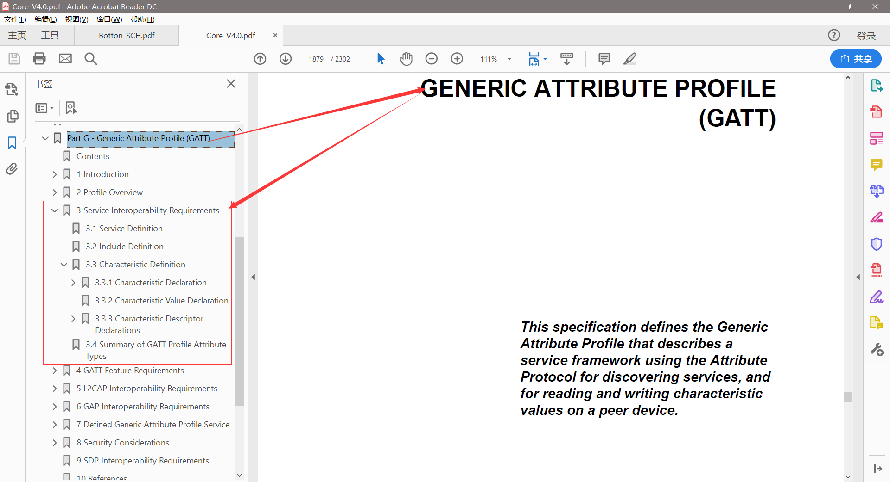
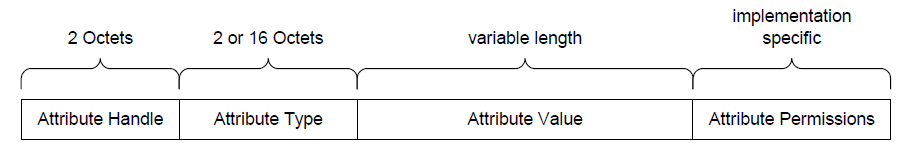
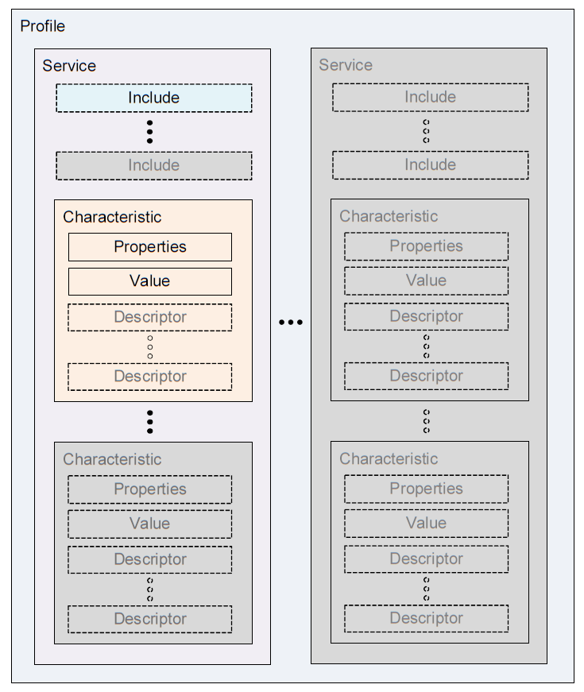
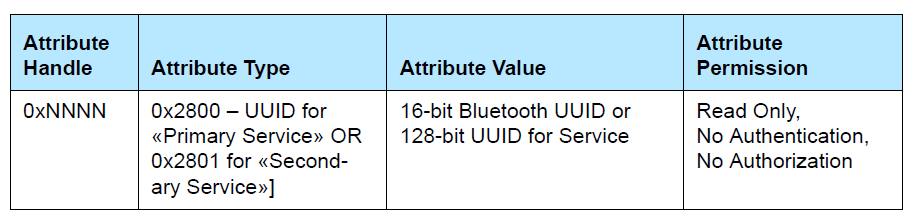
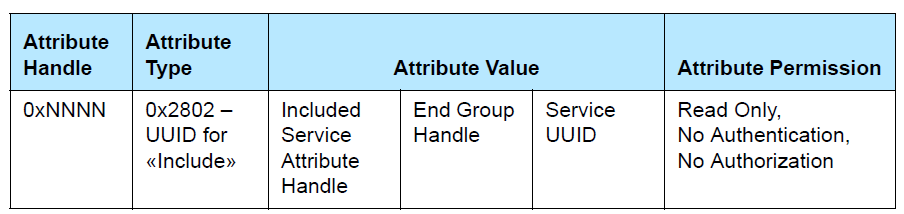
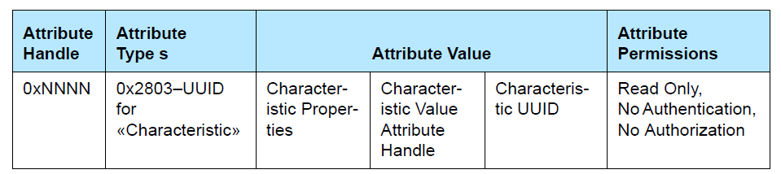
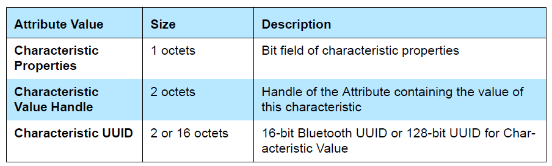
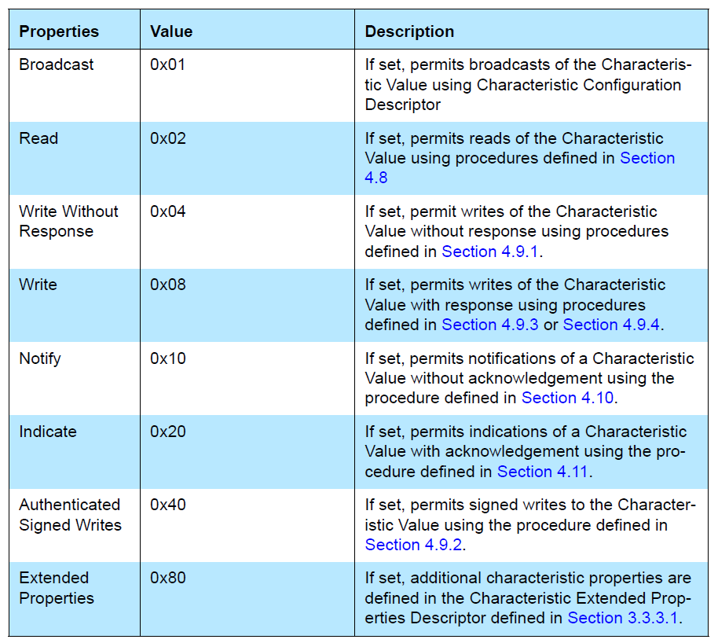
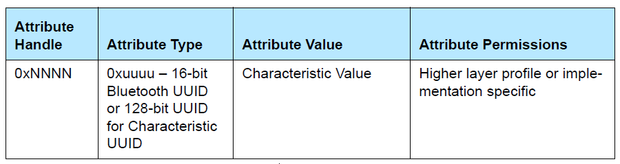
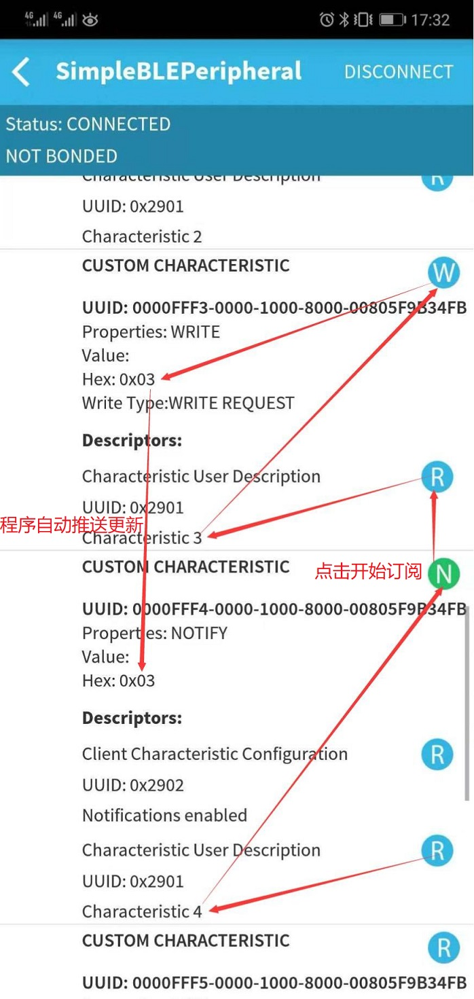

# SimpleBLEPeripheral GATT Definition Hack

## 参考文档

* [Bluetooth 4.0 Core specifications - Bluetooth.org](https://www.bluetooth.org/docman/handlers/downloaddoc.ashx?doc_id=229737)  


## Logical Attribute Representation

Attribute是基础数据结构，其根据Atrribute Type中的UUID的不同，而变成`Service`/`Included Services`/`Characteristic`等不同的性质数据结构，可以认为Atrribute是一个房间（struct），根据房间的功能（UUID的不同）来确定其大体功能，譬如卧室、书房、会客室等；



## GATT Profile Hierarchy



### Service

* In GATT, a service is defined by its service definition, There are two types of services: primary service and secondary service
  * A primary service is a service that exposes the primary usable functionality of this device.
  * A secondary service is a service that is only intended to be referenced from a primary service or another secondary service or other higher layer specification.

*Service Declaration*



### Included Services

An included service is a method to reference another service definition existing on the server into the service being defined.

*Included Declaration*



### Characteristic

A characteristic is a value used in a service along with properties and configuration information about how the value is accessed and information about how the value is displayed or represented.

*Characteristic Declaration*



Attribute Value Field in characteristic declaration



Characteristic Properties In the Attribute Value



*Characteristic Value Declaration*



*Characteristic Descriptor Declarations*

* Attribute Type 0x2900 for Characteristic Extended Properties
* Attribute Type 0x2901 for Characteristic User Description
* Attribute Type 0x2902 for Client Characteristic Configuration
* Attribute Type 0x2903 for Server Characteristic Configuration
* Attribute Type 0x2904 for Characteristic Presentation Format

## SimpleBLEPeripheral GATT

```C
static gattAttribute_t simpleProfileAttrTbl[SERVAPP_NUM_ATTR_SUPPORTED] = 
{
    // Simple Profile Service: Service Declaration
    { 
        /**
         * // Size of 16-bit Bluetooth UUID
         * #define ATT_BT_UUID_SIZE                 2
         *
         * 
         * #define GATT_PRIMARY_SERVICE_UUID                  0x2800 // Primary Service
         *
         * // Primary Service UUID
         * CONST uint8 primaryServiceUUID[ATT_BT_UUID_SIZE] =
         * {
         *   LO_UINT16( GATT_PRIMARY_SERVICE_UUID ), HI_UINT16( GATT_PRIMARY_SERVICE_UUID )
         * };
         */
        { ATT_BT_UUID_SIZE, primaryServiceUUID }, /* type */          // {2, 0x2800}
        /**
         * #define GATT_PERMIT_READ                 0x01 //!< Attribute is Readable
         * #define GATT_PERMIT_WRITE                0x02 //!< Attribute is Writable
         * #define GATT_PERMIT_AUTHEN_READ          0x04 //!< Read requires Authentication
         * #define GATT_PERMIT_AUTHEN_WRITE         0x08 //!< Write requires Authentication
         * #define GATT_PERMIT_AUTHOR_READ          0x10 //!< Read requires Authorization
         * #define GATT_PERMIT_AUTHOR_WRITE         0x20 //!< Write requires Authorization
         * #define GATT_PERMIT_ENCRYPT_READ         0x40 //!< Read requires Encryption
         * #define GATT_PERMIT_ENCRYPT_WRITE        0x80 //!< Write requires Encryption
         */
        GATT_PERMIT_READ,                         /* permissions */
        0,                                        /* handle */
        /**
         * // Simple Profile Service attribute
         * static CONST gattAttrType_t simpleProfileService = { ATT_BT_UUID_SIZE, simpleProfileServUUID };
         * 
         * // Simple Profile Service UUID
         * #define SIMPLEPROFILE_SERV_UUID               0xFFF0
         * 
         * // Simple GATT Profile Service UUID: 0xFFF0
         * CONST uint8 simpleProfileServUUID[ATT_BT_UUID_SIZE] =
         * { 
         *   LO_UINT16(SIMPLEPROFILE_SERV_UUID), HI_UINT16(SIMPLEPROFILE_SERV_UUID)
         * };
         */
        (uint8 *)&simpleProfileService            /* pValue */      // {2, 0xFFF0}
    },

    // Characteristic 1 Declaration
    { 
        /**
         * // GATT Declarations
         * #define GATT_PRIMARY_SERVICE_UUID                  0x2800 // Primary Service
         * #define GATT_SECONDARY_SERVICE_UUID                0x2801 // Secondary Service
         * #define GATT_INCLUDE_UUID                          0x2802 // Include
         * #define GATT_CHARACTER_UUID                        0x2803 // Characteristic
         *
         * // Characteristic UUID
         * CONST uint8 characterUUID[ATT_BT_UUID_SIZE] =
         * {
         *   LO_UINT16( GATT_CHARACTER_UUID ), HI_UINT16( GATT_CHARACTER_UUID )
         * };
         */
        { ATT_BT_UUID_SIZE, characterUUID },                        // {2, 0x2803}
        /**
         * #define GATT_PERMIT_READ                 0x01 //!< Attribute is Readable
         * #define GATT_PERMIT_WRITE                0x02 //!< Attribute is Writable
         * #define GATT_PERMIT_AUTHEN_READ          0x04 //!< Read requires Authentication
         * #define GATT_PERMIT_AUTHEN_WRITE         0x08 //!< Write requires Authentication
         * #define GATT_PERMIT_AUTHOR_READ          0x10 //!< Read requires Authorization
         * #define GATT_PERMIT_AUTHOR_WRITE         0x20 //!< Write requires Authorization
         * #define GATT_PERMIT_ENCRYPT_READ         0x40 //!< Read requires Encryption
         * #define GATT_PERMIT_ENCRYPT_WRITE        0x80 //!< Write requires Encryption
         */
        GATT_PERMIT_READ, 
        0,
        /**
         * #define GATT_PROP_BCAST                  0x01 //!< Permits broadcasts of the Characteristic Value
         * #define GATT_PROP_READ                   0x02 //!< Permits reads of the Characteristic Value
         * #define GATT_PROP_WRITE_NO_RSP           0x04 //!< Permits writes of the Characteristic Value without response
         * #define GATT_PROP_WRITE                  0x08 //!< Permits writes of the Characteristic Value with response
         * #define GATT_PROP_NOTIFY                 0x10 //!< Permits notifications of a Characteristic Value without acknowledgement
         * #define GATT_PROP_INDICATE               0x20 //!< Permits indications of a Characteristic Value with acknowledgement
         * #define GATT_PROP_AUTHEN                 0x40 //!< Permits signed writes to the Characteristic Value
         * #define GATT_PROP_EXTENDED               0x80 //!< Additional characteristic properties are defined in the Characteristic Extended Properties Descriptor
         * 
         * // Simple Profile Characteristic 1 Properties
         * static uint8 simpleProfileChar1Props = GATT_PROP_READ | GATT_PROP_WRITE;
         */
        &simpleProfileChar1Props
    },

    // Characteristic Value 1
    { 
        /**
         * // Key Pressed UUID
         * #define SIMPLEPROFILE_CHAR1_UUID            0xFFF1
         * #define SIMPLEPROFILE_CHAR2_UUID            0xFFF2
         * #define SIMPLEPROFILE_CHAR3_UUID            0xFFF3
         * #define SIMPLEPROFILE_CHAR4_UUID            0xFFF4
         * #define SIMPLEPROFILE_CHAR5_UUID            0xFFF5
         *
         * // Characteristic 1 UUID: 0xFFF1
         * CONST uint8 simpleProfilechar1UUID[ATT_BT_UUID_SIZE] =
         * { 
         *   LO_UINT16(SIMPLEPROFILE_CHAR1_UUID), HI_UINT16(SIMPLEPROFILE_CHAR1_UUID)
         * };
         */
        { ATT_BT_UUID_SIZE, simpleProfilechar1UUID },
        GATT_PERMIT_READ | GATT_PERMIT_WRITE, 
        0, 
        /**
         * // Characteristic 1 Value
         * static uint8 simpleProfileChar1 = 0;
         */
        &simpleProfileChar1 
    },

    // Characteristic 1 User Description
    { 
        /**
         * // GATT Descriptors
         * #define GATT_CHAR_EXT_PROPS_UUID                   0x2900 // Characteristic Extended Properties
         * #define GATT_CHAR_USER_DESC_UUID                   0x2901 // Characteristic User Description
         * #define GATT_CLIENT_CHAR_CFG_UUID                  0x2902 // Client Characteristic Configuration
         * #define GATT_SERV_CHAR_CFG_UUID                    0x2903 // Server Characteristic Configuration
         * #define GATT_CHAR_FORMAT_UUID                      0x2904 // Characteristic Presentation Format
         * #define GATT_CHAR_AGG_FORMAT_UUID                  0x2905 // Characteristic Aggregate Format
         * #define GATT_VALID_RANGE_UUID                      0x2906 // Valid Range
         * #define GATT_EXT_REPORT_REF_UUID                   0x2907 // External Report Reference Descriptor
         * #define GATT_REPORT_REF_UUID                       0x2908 // Report Reference Descriptor
         * 
         * // Characteristic User Description UUID
         * CONST uint8 charUserDescUUID[ATT_BT_UUID_SIZE] =
         * {
         *   LO_UINT16( GATT_CHAR_USER_DESC_UUID ), HI_UINT16( GATT_CHAR_USER_DESC_UUID )
         * };
         */
        { ATT_BT_UUID_SIZE, charUserDescUUID },
        GATT_PERMIT_READ, 
        0, 
        /**
         * // Simple Profile Characteristic 1 User Description
         * static uint8 simpleProfileChar1UserDesp[17] = "Characteristic 1";
         */
        simpleProfileChar1UserDesp 
    },      

    [...省略]
};
```

## GATT Routines

* `int main(void)` 
  * `osal_init_system()`
    * `osalInitTasks()`
      * `SimpleBLEPeripheral_Init( taskID )`
        * `SimpleProfile_AddService( GATT_ALL_SERVICES )`
          * `status = GATTServApp_RegisterService( simpleProfileAttrTbl, GATT_NUM_ATTRS( simpleProfileAttrTbl ), GATT_MAX_ENCRYPT_KEY_SIZE, &simpleProfileCBs )`
            * `static gattAttribute_t simpleProfileAttrTbl[SERVAPP_NUM_ATTR_SUPPORTED]`
            * `simpleProfileCBs`
              ```C
              // Simple Profile Service Callbacks
              CONST gattServiceCBs_t simpleProfileCBs =
              {
                  simpleProfile_ReadAttrCB,  // Read callback function pointer
                  simpleProfile_WriteAttrCB, // Write callback function pointer
                  NULL                       // Authorization callback function pointer
              };
              ```
        * `VOID SimpleProfile_RegisterAppCBs( &simpleBLEPeripheral_SimpleProfileCBs )`
          ```C
          bStatus_t SimpleProfile_RegisterAppCBs( simpleProfileCBs_t *appCallbacks )
          {
              if ( appCallbacks )
              {
                  /**
                   * typedef struct
                   * {
                   *     simpleProfileChange_t        pfnSimpleProfileChange;  // Called when characteristic value changes
                   * } simpleProfileCBs_t;
                   *
                   * // Simple GATT Profile Callbacks
                   * static simpleProfileCBs_t simpleBLEPeripheral_SimpleProfileCBs =
                   * {
                   *     simpleProfileChangeCB    // Charactersitic value change callback
                   * };
                   */
                  simpleProfile_AppCBs = appCallbacks;
          
                  return ( SUCCESS );
              }
              else
              {
                  return ( bleAlreadyInRequestedMode );
              }
          }
          ```
          * `static bStatus_t simpleProfile_WriteAttrCB( uint16 connHandle, gattAttribute_t *pAttr, uint8 *pValue, uint8 len, uint16 offset, uint8 method )` 该函数是蓝牙库自己回调的
            * `simpleProfile_AppCBs->pfnSimpleProfileChange( notifyApp )`
              ```C
              static void simpleProfileChangeCB( uint8 paramID )
              {
                  uint8 newValue;
              
                  switch( paramID )
                  {
                      case SIMPLEPROFILE_CHAR1:
                          SimpleProfile_GetParameter( SIMPLEPROFILE_CHAR1, &newValue );
              
              #if (defined HAL_LCD) && (HAL_LCD == TRUE)
                          HalLcdWriteStringValue( "Char 1:", (uint16)(newValue), 10,  HAL_LCD_LINE_3 );
              #endif // (defined HAL_LCD) && (HAL_LCD == TRUE)
              
                          break;
              
                      case SIMPLEPROFILE_CHAR3:
                          SimpleProfile_GetParameter( SIMPLEPROFILE_CHAR3, &newValue );
              
              #if (defined HAL_LCD) && (HAL_LCD == TRUE)
                          HalLcdWriteStringValue( "Char 3:", (uint16)(newValue), 10,  HAL_LCD_LINE_3 );
              #endif // (defined HAL_LCD) && (HAL_LCD == TRUE)
              
                          break;
              
                      default:
                          // should not reach here!
                          break;
                  }
              }
              ```
              * `SimpleProfile_GetParameter( SIMPLEPROFILE_CHAR1, &newValue )`
                ```C
                bStatus_t SimpleProfile_GetParameter( uint8 param, void *value )
                {
                    bStatus_t ret = SUCCESS;
                    switch ( param )
                    {
                        case SIMPLEPROFILE_CHAR1:
                            *((uint8*)value) = simpleProfileChar1;
                            break;
                
                        case SIMPLEPROFILE_CHAR2:
                            *((uint8*)value) = simpleProfileChar2;
                            break;      
                
                        case SIMPLEPROFILE_CHAR3:
                            *((uint8*)value) = simpleProfileChar3;
                            break;  
                
                        case SIMPLEPROFILE_CHAR4:
                            *((uint8*)value) = simpleProfileChar4;
                            break;
                
                        case SIMPLEPROFILE_CHAR5:
                            VOID memcpy( value, simpleProfileChar5, SIMPLEPROFILE_CHAR5_LEN );
                            break;      
                
                        default:
                            ret = INVALIDPARAMETER;
                            break;
                    }
                
                    return ( ret );
                }
                ```
              * `bStatus_t SimpleProfile_SetParameter( uint8 param, uint8 len, void *value )`
                ```C
                bStatus_t SimpleProfile_SetParameter( uint8 param, uint8 len, void *value )
                {
                    bStatus_t ret = SUCCESS;
                    switch ( param )
                    {
                        case SIMPLEPROFILE_CHAR1:
                            if ( len == sizeof ( uint8 ) ) 
                            {
                                simpleProfileChar1 = *((uint8*)value);
                            }
                            else
                            {
                                ret = bleInvalidRange;
                            }
                            break;
                
                        case SIMPLEPROFILE_CHAR2:
                            if ( len == sizeof ( uint8 ) ) 
                            {
                                simpleProfileChar2 = *((uint8*)value);
                            }
                            else
                            {
                                ret = bleInvalidRange;
                            }
                            break;
                
                        case SIMPLEPROFILE_CHAR3:
                            if ( len == sizeof ( uint8 ) ) 
                            {
                                simpleProfileChar3 = *((uint8*)value);
                            }
                            else
                            {
                                ret = bleInvalidRange;
                            }
                            break;
                
                        case SIMPLEPROFILE_CHAR4:
                            if ( len == sizeof ( uint8 ) ) 
                            {
                                simpleProfileChar4 = *((uint8*)value);
                
                                // See if Notification has been enabled
                                GATTServApp_ProcessCharCfg( simpleProfileChar4Config, &simpleProfileChar4, FALSE,
                                        simpleProfileAttrTbl, GATT_NUM_ATTRS( simpleProfileAttrTbl ),
                                        INVALID_TASK_ID, simpleProfile_ReadAttrCB );
                            }
                            else
                            {
                                ret = bleInvalidRange;
                            }
                            break;
                
                        case SIMPLEPROFILE_CHAR5:
                            if ( len == SIMPLEPROFILE_CHAR5_LEN ) 
                            {
                                VOID memcpy( simpleProfileChar5, value, SIMPLEPROFILE_CHAR5_LEN );
                            }
                            else
                            {
                                ret = bleInvalidRange;
                            }
                            break;
                
                        default:
                            ret = INVALIDPARAMETER;
                            break;
                    }
                
                    return ( ret );
                }
                ```
      * `uint16 SimpleBLEPeripheral_ProcessEvent( uint8 task_id, uint16 events )`
        * `performPeriodicTask()`
          ```C
          static void performPeriodicTask( void )
          {
              uint8 valueToCopy;
              uint8 stat;
          
              // Call to retrieve the value of the third characteristic in the profile
              stat = SimpleProfile_GetParameter( SIMPLEPROFILE_CHAR3, &valueToCopy);
          
              if( stat == SUCCESS )
              {
                  /*
                   * Call to set that value of the fourth characteristic in the profile. Note
                   * that if notifications of the fourth characteristic have been enabled by
                   * a GATT client device, then a notification will be sent every time this
                   * function is called.
                   */
                  SimpleProfile_SetParameter( SIMPLEPROFILE_CHAR4, sizeof(uint8), &valueToCopy);
              }
          }
          ```

GATT表`simpleProfileAttrTbl`在系统初始化阶段就被加载了。

## SimpleBLEPeripheral Test


