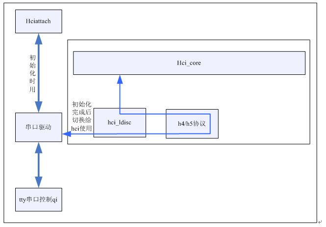
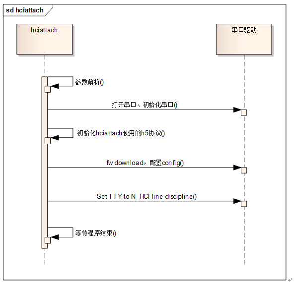

# Bluez HCI Principle

Bluetooth USB dongle是蓝牙接收器，作为Host功能，貌似只要实现到HCI这部分就够了；

## 参考文档

* **[Ubuntu系统(bluez)蓝牙调试](https://blog.csdn.net/zjli321/article/details/52122447)**
* [Android blueZ HCI（二）：hcitool hcidump常用方法](https://blog.csdn.net/xubin341719/article/details/38640725)

## 基础理解

* HCI: Host Controller Interface，用来沟通Host和Module。Host通常就是PC， Module则是以各种物理连接形式（USB,serial,pc-card等）连接到PC上的bluetooth Dongle。
* HCI则比较特殊，它一部分在软件中实现，用来给上层协议和程序提供访问接口（Bluez中,hci.c hci_usb.c，hci_sock.c等）.另一部分也是在Firmware中实现，用来将软件部分的指令等用底层协议明白的方式传递给底层。

##  Bluez

* 使用Bluez时，需要内核提供一系列的socket接口来操作蓝牙；
* 蓝牙框架分成两部分：
  * 蓝牙驱动部分：含hci层协议及蓝牙硬件接口的管理。
  * 蓝牙socket部分：负责管理提供给bluez的socket，并包含L2cap层的功能，蓝牙socket部分与蓝牙驱动部分通过hci_core来连接；
* Bluez下移植蓝牙方面看，只关心两个地方：
  * 一个是蓝牙驱动的移植，因为这部分每家公司的Firmware不一样，数据传输可能有差异；
  * 另一个是bluez的工具集中的hciattach工具（使用uart接口的蓝牙才需要这部分），绑定通信的串口；
* 对比bluedroid与bluez在蓝牙移植方面的差异，最大的不同就是hci和L2cap层所处的位置：
  * 在bluedroid中，hci和L2cap层放在bluedroid中，是在内核之上；
  * 而bluez中，hci和L2cap层不属于bluez中的代码，而是放到内核里；
* Bluez的蓝牙驱动负责hci协议的处理、与蓝牙硬件交互数据、注册hci接口供蓝牙socket部分使用。

## USB接口蓝牙

对于usb接口的蓝牙，只要给蓝牙上电，usb枚举到蓝牙设备后，就会调用蓝牙驱动的probe函数，在该函数中就会向hci_core注册接口；

## UART接口蓝牙

Uart接口蓝牙，使用那个uart口依赖硬件，同时也没办法像usb一样向串口驱动注册一个功能驱动等待probe，uart是没有枚举的过程的。所以uart接口蓝牙就需要应用层把使用的串口通知hci_core层，同时uart接口蓝牙的fw download及config配置工作也放到了应用层，这些工作都是由hciattach来实现。

串口的使用有一个切换的过程，在初始化的时候，由hciattach使用串口，初始化完成后，把串口切换给hci使用，hci负责与串口交互蓝牙数据，中间还经过了h4/h5协议层，驱动层跟移植相关只有h4/h5协议，若h4/h5使用的是内核自带的协议，那驱动层就不需要做任何的工作。 

