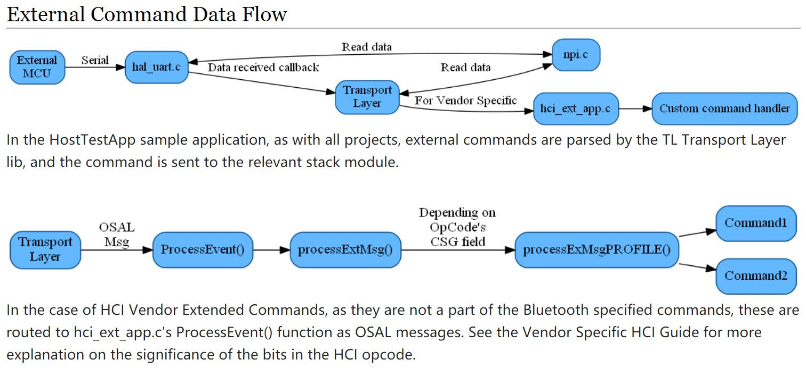

# HostTestRelease

这部分可以跟的代码貌似不对，很多代码都是在库里调用，没有源代码；

## Source Code

HostTestRelease网络处理器工程：`C:\Texas Instruments\BLE-CC254x-1.4.2.2\Projects\ble\HostTest`

## 简要说明

* 实现了网络处理器配置，即HCI控制器一部分在CC254x上运行，而应用程序和其他协议在PC机上运行；
* 应用程序通过厂商特定的HCI命令与CC254x通信，这一过程需要通过串口或者虚拟串口来读写CC254x运行的HCI；
* 可以认为HCI分为PC机部分和CC254x部分，分别有数据编解码程序，然后通过串口进行物理数据通信；
* HostTestRelease工程中的hci_ext_app.c将PC发送的消息转化为调用协议栈的API功能，任何从协议栈收到的消息都会发送给外部PC；
* 以上并不是说HostTestRelease就没有了蓝牙的其他部分协议，HCI解析出来的数据还是要通过其他层的协议来做控制。

## 外部命令数据流

* [BLE HostTest Add Cmds](http://processors.wiki.ti.com/index.php/BLE_HostTest_Add_Cmds)
* [NPI_InitTransport在什么情况下被调用](https://e2echina.ti.com/question_answer/wireless_connectivity/hw_rf_proprietary/f/45/t/24401)



## Code Hacking

HCI命令解析每个厂家都可能不一样，所以移植Linux驱动的时候这部分驱动是需要移植或者修改的；

```C
uint16 HCI_EXT_App_ProcessEvent( uint8 task_id, uint16 events )
{
    if ( events & SYS_EVENT_MSG )
    {
        hciPacket_t *pMsg;

        if ( (pMsg = ( hciPacket_t *)osal_msg_receive( hciExtApp_TaskID )) != NULL )
        {
            uint8 dealloc = TRUE;

            // Process incoming messages
            switch ( pMsg->hdr.event )
            {
                // Incoming HCI extension message
                case HCI_EXT_CMD_EVENT:
                    dealloc = processExtMsg( pMsg );                    <------------------貌似只有这里面可以自己修改、定制
                    break;

                case HCI_GAP_EVENT_EVENT:
                    {
                        if ( pMsg->hdr.status == HCI_COMMAND_COMPLETE_EVENT_CODE )
                        {
                            hciEvt_CmdComplete_t *pkt = (hciEvt_CmdComplete_t *)pMsg;
                            osal_msg_hdr_t *msgHdr;
                            uint8 len;

                            msgHdr = (osal_msg_hdr_t *)pMsg;
                            msgHdr--; // Backup to the msg header

                            len = (uint8)(msgHdr->len - sizeof ( hciEvt_CmdComplete_t ));

                            HCI_SendCommandCompleteEvent( HCI_COMMAND_COMPLETE_EVENT_CODE, pkt->cmdOpcode, len, pkt->pReturnParam );
                        }
                        else if ( pMsg->hdr.status == HCI_VE_EVENT_CODE )
                        {
                            hciEvt_VSCmdComplete_t *pkt = (hciEvt_VSCmdComplete_t *)pMsg;

                            HCI_SendCommandCompleteEvent(HCI_VE_EVENT_CODE, pkt->cmdOpcode,
                                    pkt->length, pkt->pEventParam);
                        }
                    }
                    break;

                default:
                    dealloc = processEvents( (osal_event_hdr_t *)pMsg );
                    break;
            }

            // Release the OSAL message
            if ( dealloc )
            {
                VOID osal_msg_deallocate( (uint8 *)pMsg );
            }
        }

        // return unprocessed events
        return (events ^ SYS_EVENT_MSG);
    }

    if ( events & GAP_EVENT_SIGN_COUNTER_CHANGED )
    {
        // Sign counter changed, save it to NV
        VOID osal_snv_write( BLE_NVID_SIGNCOUNTER, sizeof( uint32 ), &hciExtSignCounter );

        return ( events ^ GAP_EVENT_SIGN_COUNTER_CHANGED );
    }

    // Discard unknown events
    return 0;
}

/*********************************************************************
 * @fn      processExtMsg
 *
 * @brief   Parse and process incoming HCI extension messages.
 *
 * @param   pMsg - incoming HCI extension message.
 *
 * @return  none
 */
static uint8 processExtMsg( hciPacket_t *pMsg )
{
    uint8 deallocateIncoming;
    bStatus_t stat = SUCCESS;
    uint8 rspDataLen = 0;
    hciExtCmd_t msg;
    uint8 *pBuf = pMsg->pData;

    // Parse the header
    msg.pktType = *pBuf++;
    msg.opCode = BUILD_UINT16( pBuf[0], pBuf[1] );
    pBuf += 2;

    msg.len = *pBuf++;
    msg.pData = pBuf;

    switch( msg.opCode >> 7 )
    {
        case HCI_EXT_L2CAP_SUBGRP:
            stat = processExtMsgL2CAP( (msg.opCode & 0x007F), &msg, &rspDataLen );
            break;

        case HCI_EXT_ATT_SUBGRP:
            stat = processExtMsgATT( (msg.opCode & 0x007F), &msg );
            break;

        case HCI_EXT_GATT_SUBGRP:
            stat = processExtMsgGATT( (msg.opCode & 0x007F), &msg, &rspDataLen );
            break;

        case HCI_EXT_GAP_SUBGRP:
            stat = processExtMsgGAP( (msg.opCode & 0x007F), &msg, &rspDataLen );
            break;

        case HCI_EXT_UTIL_SUBGRP:
            stat = processExtMsgUTIL( (msg.opCode & 0x007F), &msg, &rspDataLen );
            break;

        default:
            stat = FAILURE;
            break;
    }

    // Deallocate here to free up heap space for the serial message set out HCI.
    VOID osal_msg_deallocate( (uint8 *)pMsg );
    deallocateIncoming = FALSE;

    // Send back an immediate response
    rspBuf[0] = LO_UINT16( HCI_EXT_GAP_CMD_STATUS_EVENT );
    rspBuf[1] = HI_UINT16( HCI_EXT_GAP_CMD_STATUS_EVENT );
    rspBuf[2] = stat;
    rspBuf[3] = LO_UINT16( 0xFC00 | msg.opCode );
    rspBuf[4] = HI_UINT16( 0xFC00 | msg.opCode );
    rspBuf[5] = rspDataLen;

    // IMPORTANT!! Fill in Payload (if needed) in case statement

    HCI_SendControllerToHostEvent( HCI_VE_EVENT_CODE, (6 + rspDataLen), rspBuf );

    return ( deallocateIncoming );
}
```
