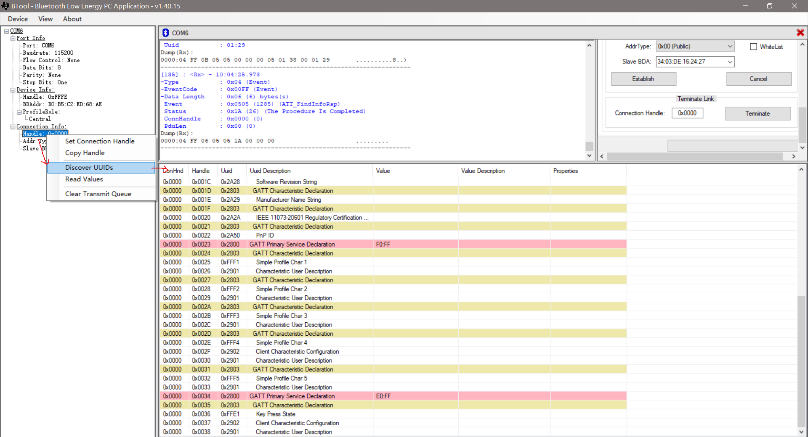

# BTool

## 工具购买

[蓝牙4.0BLE CC2540 USB dongle 协议分析仪Packet sniffer BTool](https://item.taobao.com/item.htm?spm=a230r.1.14.15.5e9e7de8xXRLdI&id=578315809886&ns=1&abbucket=6#detail)：购买一个就行了，记得购买一下烧录线，这样就可以自己烧录不同的工具包作为不同的开发工具；

## 参考文档

* [Using BTool](http://dev.ti.com/tirex/content/simplelink_cc2640r2_sdk_1_35_00_33/docs/blestack/btool_user_guide/BTool_Users_Guide/index.html)
* [CC2640R2F BLE5.0 BTool的使用](https://blog.csdn.net/leconiot/article/details/76607034?locationNum=3&fps=1)

## BTool主界面

## 基本操作

* 获取GATT表  
  
* Read/Write Characteristic  
  
