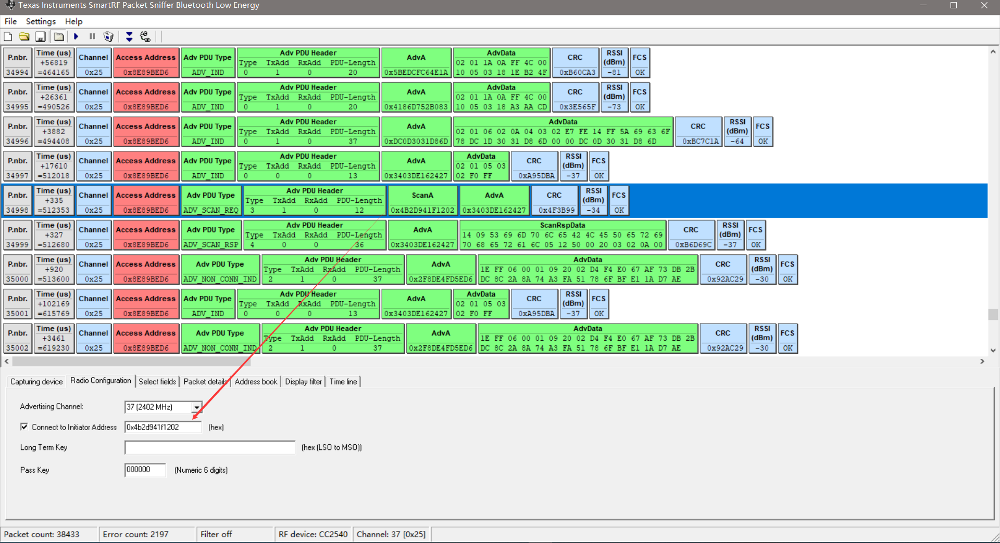
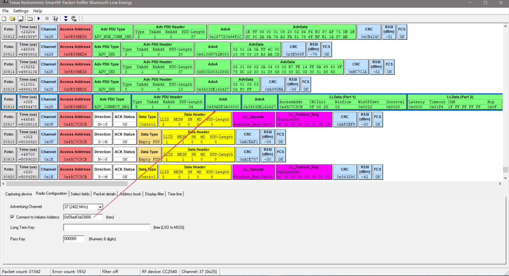
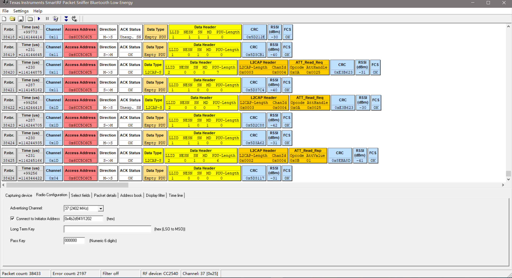

# SmartRF Packet Sniffer

## Download Tool

* [SmartRF Protocol Packet Sniffer](http://www.ti.com/tool/PACKET-SNIFFER)

## 参考文档

* [SmartRF™ Packet Sniffer User’s Manual](http://www.ti.com/lit/ug/swru187g/swru187g.pdf)
* [How to use a BLE sniffer - Part 1 (Advertisement data)](https://www.youtube.com/watch?v=K7ByRmElA5Y&t=393s)
* [How to use a BLE sniffer - Part 2 (Connections) by reverse engineering a Bluetooth lightbulb](https://www.youtube.com/watch?v=NSqrYcwmTeE)
* [如何使用CC2540 USB-Dongle进行抓取蓝牙通讯数据包](https://blog.csdn.net/zhuangjitongxue/article/details/49337445)

## 基本操作

* 打开Android手机**BLE Scanner**应用软件，开启蓝牙扫描，获取手机的蓝牙Master地址，这个地址貌似会变：  
  
* 设置手机蓝牙连接地址，发现设备连接之后会自动跳到数据通信监听：  
  
* 连接的时候因为3个通道时随机选择一个，所以多连几次就可以连接到了；
* 获取Characteristic 1 Value：  
  
